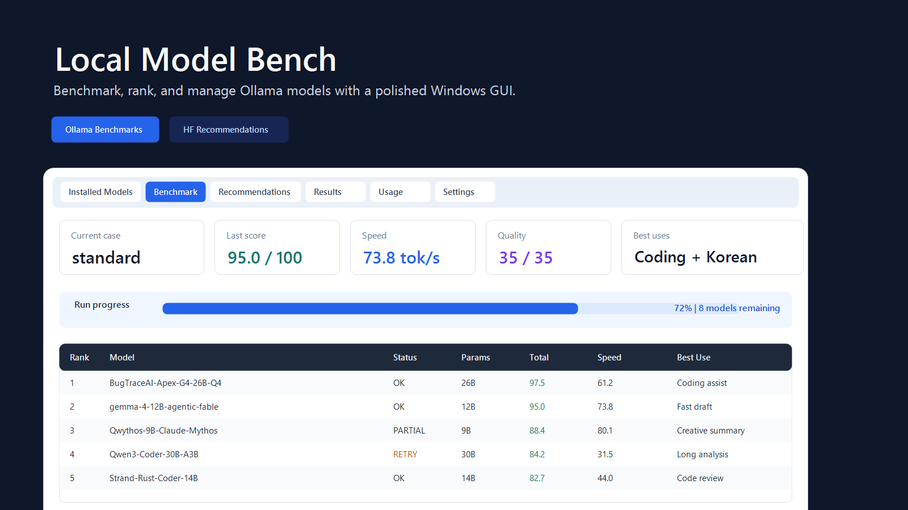
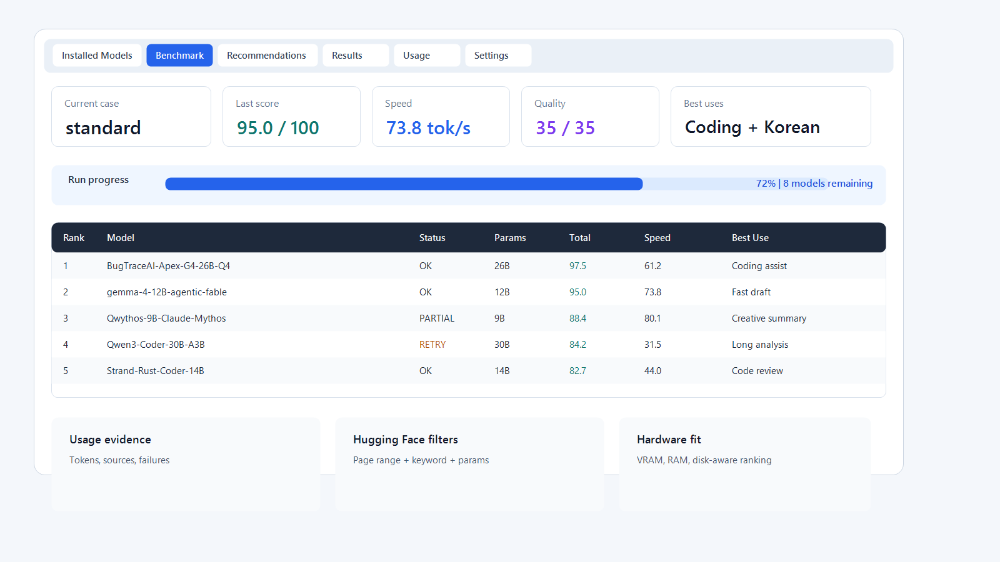

# Local Model Bench



[](https://github.com/Vinsentk/local-model-bench/actions/workflows/ci.yml)


Windows desktop app for testing, scoring, comparing, and recommending local Ollama models.

Local Model Bench is built for one practical question: which local models are actually worth keeping on your own PC?

Created by [Vinsentk](https://github.com/Vinsentk).



## Why It Exists

Local model testing often becomes a pile of terminal output, half-finished downloads, unclear failures, and benchmark notes that are hard to compare later. Local Model Bench turns that workflow into a desktop tool:

- see what is installed,
- benchmark models with visible progress,
- keep historical results,
- rank models by real local use cases,
- discover Hugging Face GGUF candidates,
- and understand local Ollama/OpenCode usage evidence without guessing.

The app is intentionally practical rather than academic. Scores are meant to help decide what to keep, retry, delete, or test next on one Windows machine.

Local Model Bench talks to your Ollama endpoint directly. It does not install a proxy, sniff packets, run a background service, or override Ollama settings.

## Features

- Lists installed Ollama models with file size, parameter size, quant, and latest benchmark context.
- Runs `smoke`, `standard`, and `thinking` benchmark modes.
- Gives larger thinking-capable models more room before marking them failed.
- Scores models out of 100 by quality, speed, stability, resource fit, and usability.
- Tracks CPU, GPU, RAM, and VRAM usage during benchmark runs.
- Shows live benchmark score cards, per-use-case rankings, retry-needed models, and detailed case output.
- Saves benchmark results to SQLite.
- Keeps deleted results as soft-deleted rows so history and recommendation exclusions remain traceable.
- Exports result views to CSV or JSON.
- Backs up the result database from the UI.
- Records local-model-bench Ollama calls as usage events with source, status, failure type, and available token counters.
- Imports historical Ollama and OpenCode logs into Usage without duplicating the same log lines.
- Shows active Ollama models from `ollama ps` / Ollama API without proxying or packet sniffing.
- Aggregates usage by model, source, failure type, and recent events for today, 7 days, 30 days, or all time.
- Shows installed model token totals for the last 1 day and 7 days.
- Searches Hugging Face GGUF Trending pages by user-selected page range, defaulting to pages 1-3.
- Adds Hugging Face-style filters for task, library, app, language, license, inference provider, and other constraints.
- Applies a final local keyword filter after the selected Trending pages are collected.
- Filters recommendations by parameter range and excludes installed or previously poor-tested models.
- Ranks recommendations against local hardware using estimated model memory, VRAM, RAM offload fit, and free storage.
- Opens Hugging Face model pages from the recommendation detail view.
- Shows streaming download progress when pulling a recommended model through the Ollama API.
- Supports canceling an active recommendation download and deleting a downloaded recommendation model.
- Supports English by default, plus Korean, Japanese, and Chinese from Settings.

## Requirements

- Windows 10 or newer
- Python 3.11 for source runs
- [Ollama](https://ollama.com/) installed
- Ollama server running locally
- At least one local Ollama model for installed-model benchmarks

Optional:

- NVIDIA GPU for faster inference and GPU/VRAM counters
- Internet access for Hugging Face recommendation search
- OpenCode logs if you want Usage to include OpenCode-originated local model calls

Default Ollama endpoint:

```text
http://127.0.0.1:11434
```

The Settings tab includes an `Auto` button that checks the current field, `OLLAMA_HOST`, `127.0.0.1:11434`, and `localhost:11434`.

## Run From Source

PowerShell:

```powershell
git clone https://github.com/Vinsentk/local-model-bench.git
Set-Location .\local-model-bench
py -3.11 -m venv .venv
.\.venv\Scripts\python.exe -m pip install -r requirements.txt
$env:PYTHONPATH = "src"
.\.venv\Scripts\python.exe -m local_model_bench.main
```

## Build Windows EXE

PowerShell:

```powershell
Set-Location .\local-model-bench
powershell -ExecutionPolicy Bypass -File .\scripts\build.ps1
```

Build output:

```text
dist\LocalModelBench\LocalModelBench.exe
```

The build embeds:

- App icon: `assets\app.ico`
- Windows version metadata: `assets\version_info.txt`
- Product name: `Local Model Bench`
- Creator/company: `Vinsentk`
- Version: `0.1.0`

## Result Data

Default result database:

```text
%USERPROFILE%\.local-model-bench\results.sqlite
```

Settings file:

```text
%USERPROFILE%\.local-model-bench\settings.json
```

In Settings you can:

- Change the result database path.
- Browse for a new DB path.
- Set the Ollama model storage path through the `OLLAMA_MODELS` user environment variable.
- Open the local data folder.
- Back up the DB.
- Change UI language.
- Change benchmark concurrency.
- Auto-detect the Ollama endpoint.

Ollama model storage is controlled by Ollama, not by the result database path. On Windows, set `OLLAMA_MODELS` to a folder such as `D:\OllamaModels` or another drive with enough free space, then restart Ollama for the change to apply.

## Screens

- `Installed Models`: installed Ollama models plus file size, parameter size, latest benchmark status, score, speed, 1-day token count, 7-day token count, and history.
- `Benchmark`: live test progress, scores, resources, detailed cases, retry-needed models, and use-case rankings.
- `Recommendations`: Hugging Face GGUF Trending page-range search, HF-style filters, keyword refinement, parameter slider, recommendation detail, HF link, excluded model notes, and local research report.
- `Results`: latest result per model, install/deleted state, sorting, soft-deleted rows, export, backup, score trend, quant comparison, and use-case leaders.
- `Usage`: active Ollama models, unified usage table, model/source usage totals, token counters when available, failure-rate summary, and recent usage events.
- `Settings`: Ollama endpoint, result DB path, Ollama model storage path, language, concurrency, app version, creator, and repository.

## Hugging Face Recommendation Search

The recommendation flow follows the Hugging Face Trending order:

- App page `1`: `https://huggingface.co/models?sort=trending`
- App page `2`: `https://huggingface.co/models?p=1&sort=trending`
- App page `3`: `https://huggingface.co/models?p=2&sort=trending`

You can change the page range from the UI. The default is `1` to `3`.

The search first collects candidates from the selected Trending pages and selected filters, then applies the user keyword locally. This makes keyword searches such as `Mythos` work as a final refinement without changing the Trending page order.

## Score System

Total score: 100 points.

| Category | Points | Meaning |
|---|---:|---|
| Quality | 35 | JSON, code, review, Korean summary, and reasoning checks |
| Speed | 25 | Average generation speed |
| Stability | 15 | Timeout, empty output, format failure, and partial failures |
| Resource fit | 15 | Fit against local VRAM/RAM |
| Usability | 10 | Practical pass/fail reliability |

The score is not a scientific benchmark. It is a practical local-use score for deciding which models are worth using on a specific PC.

## Benchmark Modes

- `smoke`: quick OK response check.
- `standard`: smoke plus JSON, code, review, Korean summary, and simple reasoning checks.
- `thinking`: standard checks plus a longer reasoning-oriented check and longer timeout/context settings.

Runtime states distinguish:

- `OK`
- `PARTIAL`
- `TIMEOUT`
- `LENGTH`
- `EMPTY`
- `RUNTIME`

## Usage Analytics

Usage analytics are evidence-based and intentionally limited:

- Calls made by this app are recorded as `source=local-model-bench`.
- The Usage tab can import `%LOCALAPPDATA%\Ollama\server*.log` to show historical `/api/generate` and `/api/chat` calls.
- The Usage tab can import OpenCode log lines that include Ollama model and token evidence.
- Other callers are not guessed. If future evidence is unavailable, source remains `unknown`.
- Codex, OpenCode, Hermes, or other client attribution requires separate evidence from those tools; Ollama server logs alone usually show the request, model, duration, and HTTP status, not the caller.
- Historical token counts that were not recorded are shown as `unavailable`; the app does not estimate old token usage.
- No proxy, packet sniffing, background service, or Ollama setting override is used.

Failure types:

- `timeout`
- `length`
- `empty response`
- `runtime error`
- `connection error`
- `unknown`

## Tests

PowerShell:

```powershell
Set-Location .\local-model-bench
$env:PYTHONPATH = "src"
py -3.11 -m compileall -q src tests
py -3.11 -m pytest -q
```

## Project Layout

```text
src/local_model_bench/
  benchmark.py       Benchmark cases and runner
  hardware.py        CPU/RAM/GPU/disk detection
  hf_search.py       Hugging Face GGUF candidate search
  i18n.py            UI text and use-case labels
  models.py          Dataclasses
  ollama_logs.py     Read-only Ollama server log importer for Usage
  ollama_client.py   Ollama API and hidden subprocess wrappers
  opencode_logs.py   Read-only OpenCode log importer for Usage
  ranker.py          Hardware-aware model recommendation ranking
  resources.py       Runtime resource monitoring
  scoring.py         Score calculation and use-case mapping
  store.py           SQLite result storage
  ui.py              PySide6 Windows UI
```

## Documentation

- [Product requirements](docs/PRD.md)
- [Architecture and integration boundaries](docs/ARCHITECTURE.md)
- [Public release checklist](docs/PUBLIC_RELEASE.md)

## License

MIT. See [LICENSE](LICENSE).
